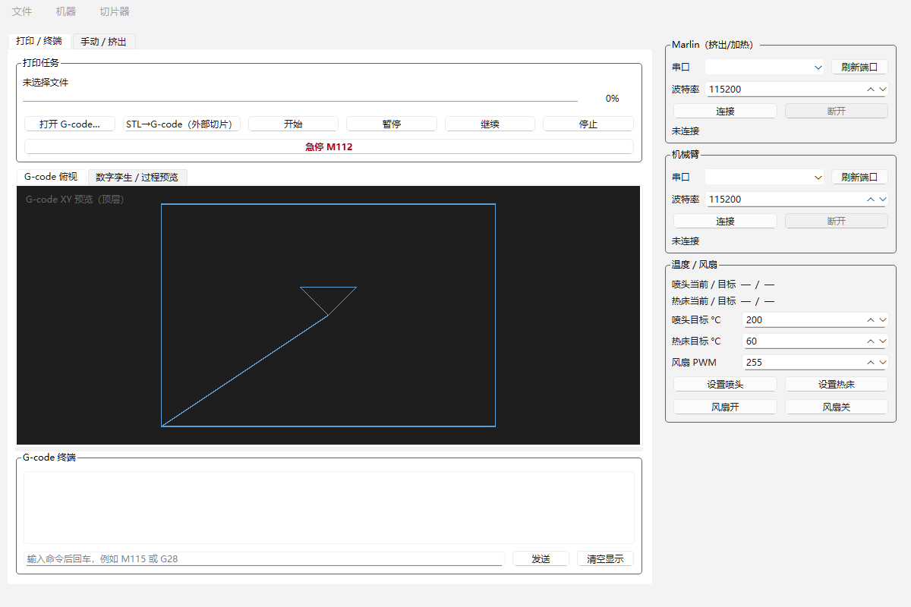
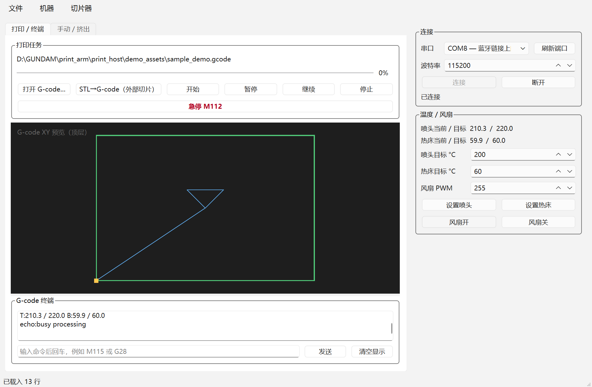

# 机械臂 3D 打印上位机演示程序

这是一个面向课程设计答辩整理的机械臂 3D 打印上位机演示工程，重点展示以下几部分能力：

- 机械臂 3D 打印上位机界面
- G-code 导入、预览与离线回放
- 数字孪生联动显示
- 多种空间打印演示轨迹
- 六轴机械臂参数、工艺参数、材料参数的可视化配置

本仓库只保留了上位机演示程序及其演示资源，已经从原始课程资料中拆分整理出来，适合单独上传到 GitHub 展示与答辩使用。



## 主要功能

1. 上位机主界面
   - 串口连接区：支持 Marlin 类 FDM 控制板和机械臂控制器的独立串口配置
   - 打印任务区：支持打开本地 G-code、载入演示轨迹、开始离线回放
   - G-code 终端区：显示串口日志、离线回放日志和名义电机输出信息

2. 机械臂数字孪生预览
   - 显示六轴机械臂当前姿态
   - 显示喷嘴末端位置与打印轨迹
   - 显示打印过程中的状态、进度、预检结果、姿态来源等运行信息
   - 支持打印完成后继续旋转、缩放观察轨迹和结果

3. G-code 预览与离线演示
   - 不连接真实 Marlin 串口也能直接运行演示
   - 导入 G-code 后可进行 XY 轨迹预览
   - 支持区分挤出工作段和空运行段
   - 离线回放时，G-code、控制输出和数字孪生窗口同步联动

4. 参数配置
   - 六轴电机参数
   - 六轴角度与关节限位
   - DH 参数与工作空间参数
   - 喷嘴 TCP、喷嘴直径、安全抬升高度
   - 材料参数、温度参数、回抽参数
   - 打印速度、空走速度、层高、线宽、流量倍率等工艺参数

5. 课程答辩演示资源
   - 空间曲线
   - 空间规则正方体
   - 反重力斜向打印
   - 空间桁架桥
   - 实心空间拱梁

## 演示轨迹推荐

仓库内已自带如下演示 G-code：

- `demo_assets/sample_demo.gcode`：平面基础示例
- `demo_assets/demo_space_curve.gcode`：空间曲线
- `demo_assets/demo_space_cube.gcode`：空间规则正方体
- `demo_assets/demo_antigravity_slope.gcode`：反重力斜向打印
- `demo_assets/demo_spatial_truss_bridge.gcode`：空间桁架桥
- `demo_assets/demo_solid_spatial_arch_beam.gcode`：实心空间拱梁

其中答辩时最推荐优先展示：

1. `demo_solid_spatial_arch_beam.gcode`
2. `demo_spatial_truss_bridge.gcode`
3. `demo_antigravity_slope.gcode`



## 运行环境

- 操作系统：Windows
- Python：推荐 `3.11` 或 `3.12`
- 依赖：
  - `PySide6>=6.6.0`
  - `pyserial>=3.5`

安装依赖：

```powershell
pip install -r requirements.txt
```

## 启动方式

### 方式一：一键启动

直接双击仓库根目录下的：

```text
start_print_host.bat
```

### 方式二：PowerShell 启动

```powershell
.\run_print_host.ps1
```

### 方式三：Python 模块启动

```powershell
python -m print_host
```

## 演示操作说明

### 一、最快的答辩演示流程

1. 启动程序
2. 在“打印 / 终端”页点击“载入空间桁架桥”，或者通过菜单“演示轨迹”选择其他示例
3. 观察：
   - `G-code XY 预览`
   - `数字孪生预览`
   - `G-code 终端`
4. 点击“开始离线回放”
5. 程序会在不连接 Marlin 串口的情况下，直接执行软件回放
6. 此时可以同步展示：
   - G-code 逐行执行
   - 名义电机输出信息
   - 数字孪生机械臂姿态变化
   - 打印轨迹构建过程
7. 回放完成后，在数字孪生窗口中继续旋转、缩放观察结果

### 二、推荐的答辩展示顺序

1. 先展示 `demo_solid_spatial_arch_beam.gcode`
   - 说明机械臂打印不仅能做空间路径，还能做更接近实体的空间结构
2. 再展示 `demo_spatial_truss_bridge.gcode`
   - 说明连续曲线桥、空间桁架和多姿态联动能力
3. 最后展示 `demo_antigravity_slope.gcode`
   - 强调机械臂相较传统三轴打印在斜向成形、空间路径和姿态自由度方面的优势

## 仓库结构

```text
robot-arm-3d-print-host/
├─ app/                    运行配置与本地配置文件
├─ demo_assets/            演示 G-code、预览图、PPT 素材
├─ docs/                   说明文档
├─ print_host/             上位机源码
├─ requirements.txt        Python 依赖
├─ run_print_host.ps1      PowerShell 启动脚本
└─ start_print_host.bat    Windows 一键启动脚本
```

## 当前工程边界

这个版本已经能很好地承担课程设计展示与答辩任务，但仍有几个点属于“名义参数”，后续接入真实设备时需要继续标定：

- 真实机械臂各关节零位
- 真实机械结构对应的关节限位角
- 机械臂基座到打印平台的精确坐标变换
- 喷嘴相对末端法兰的真实 TCP 偏置
- 真实串口反馈协议中的状态字段定义

也就是说，这个仓库现在已经是一个完整可演示的上位机工程，但如果要进一步走向真实打印闭环，还需要做实体测量和实机标定。

## 补充说明

- 当前版本支持“离线演示优先”，方便答辩现场不接硬件直接展示
- 项目中保留了演示截图和示例 G-code，打开即用
- 仓库中的参数配置更偏向课程设计展示与数字孪生联调，不代表最终实机安全限位

