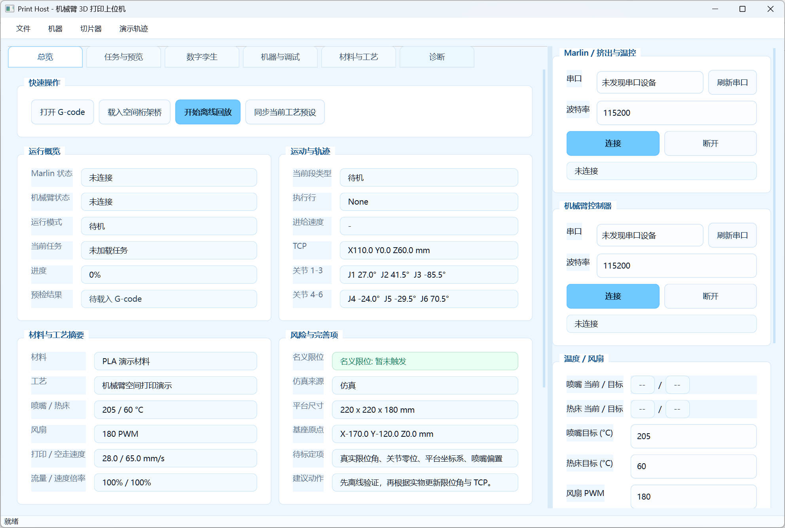
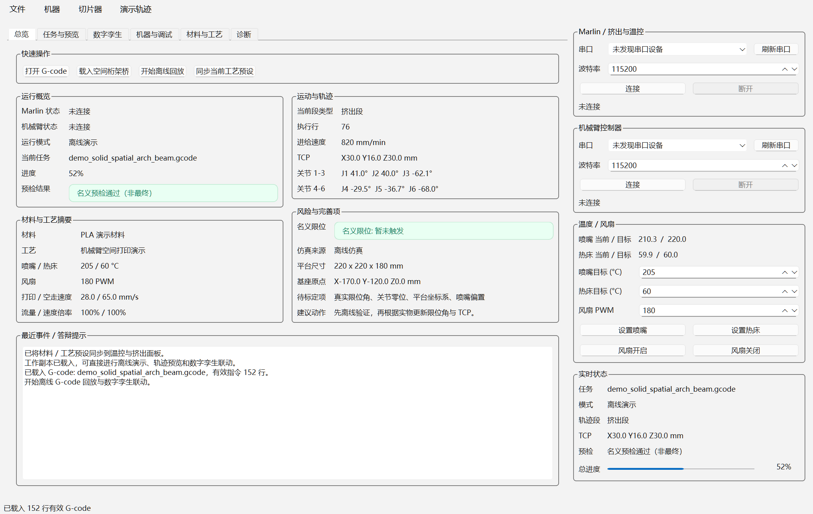
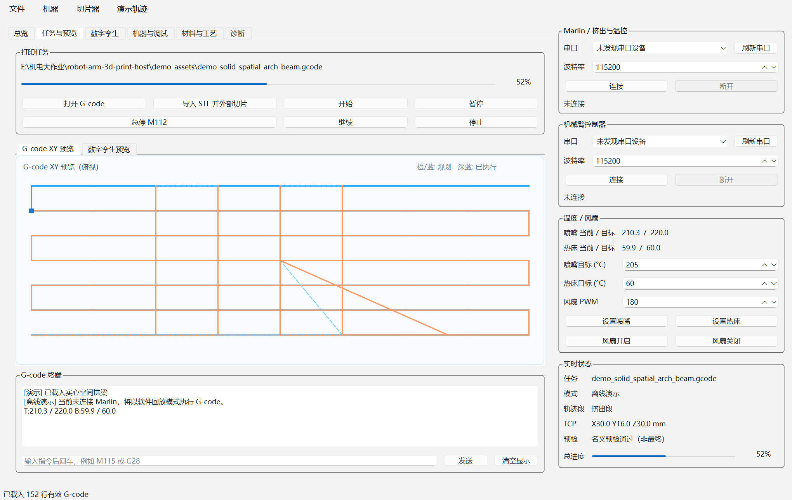
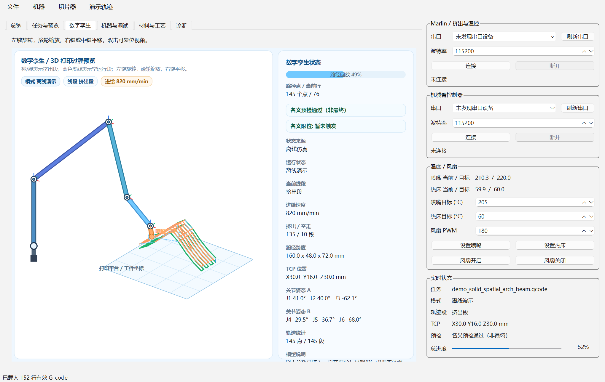
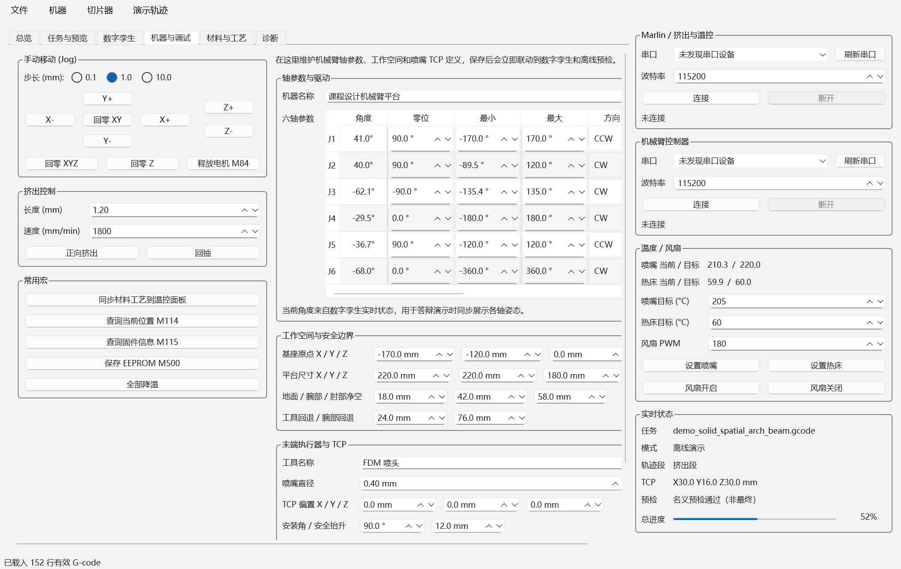
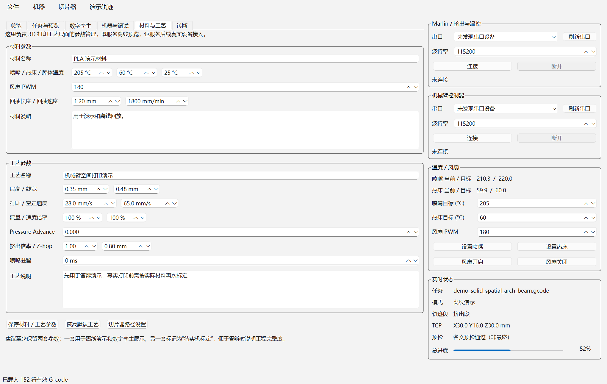
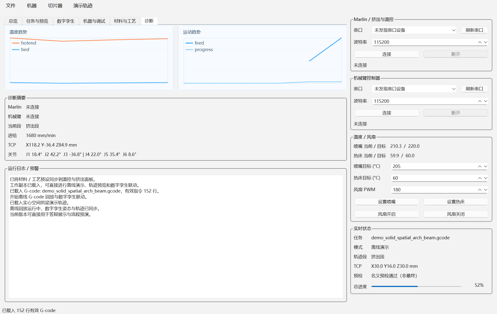

# 机械臂 3D 打印上位机演示程序

这是一个面向课程设计答辩整理的机械臂 3D 打印上位机演示工程，目标不是做一个简单的学生作业界面，而是尽可能接近“真实机械臂 3D 打印上位机”的展示型原型。

当前版本已经形成了比较完整的演示闭环：

- G-code 导入、离线回放与进度跟踪
- 数字孪生机械臂与打印轨迹联动预览
- 六轴参数、限位、TCP、工作空间配置
- 材料、温度、风扇、回抽、流量、速度等工艺参数管理
- 外部切片器接入
- 诊断趋势、运行事件、预检结果与完善项展示

本仓库是从原课程资料中拆分整理后的 GitHub 版本，只保留上位机程序、演示资源和说明文档，便于独立运行、展示和持续更新。



## 项目定位

这个版本主要服务三类场景：

1. 课程设计答辩展示  
   通过离线回放和数字孪生联动，展示机械臂 3D 打印相较传统三轴打印的空间路径优势。

2. 打印流程预演  
   在不接真实硬件时先导入 G-code，检查路径、姿态、预检结果、进度和名义限位风险。

3. 后续实机接入过渡  
   通过保留串口、工艺、切片和状态结构，为后续接真实机械臂控制器、真实 Marlin 板和真实坐标标定预留接口。

## 当前界面结构

程序主界面由“左侧设备与运行侧栏 + 右侧六个功能页”构成。

### 左侧侧栏

- `Marlin / 挤出与温控`
  - 串口连接、断开、端口刷新
- `机械臂控制器`
  - 机械臂控制器串口连接与状态显示
- `温控面板`
  - 喷嘴温度、热床温度、风扇控制
- `实时状态`
  - 当前任务、运行模式、轨迹段、TCP、预检状态、总进度

### 右侧六个功能页

1. `总览`
   - 运行概览
   - 材料与工艺摘要
   - 运动与轨迹摘要
   - 风险与完善项
   - 最近事件 / 答辩提示
   - 快速操作按钮

2. `任务与预览`
   - 打开 G-code
   - 导入 STL 并外部切片
   - 开始 / 暂停 / 继续 / 停止 / 急停
   - `G-code XY 预览`
   - `数字孪生预览`
   - `G-code 终端`

3. `数字孪生`
   - 3D 打印过程预览
   - 打印平台、路径、喷嘴、机械臂姿态联动显示
   - 进度、预检、关节姿态、TCP、轨迹统计
   - 支持旋转、缩放、平移和双击复位视角

4. `机器与调试`
   - 点动控制
   - 挤出 / 回抽
   - 常用宏
   - 六轴参数
   - 工作空间与安全边界
   - 末端执行器与 TCP 设置

5. `材料与工艺`
   - 材料参数
   - 温度参数
   - 风扇与回抽参数
   - 层高、线宽、速度、流量、Pressure Advance、Z-hop
   - 工艺说明与演示版本记录
   - 切片器路径设置入口

6. `诊断`
   - 温度趋势
   - 运动趋势
   - 连接摘要
   - 运行日志 / 预警

## 主要功能说明

### 1. 离线回放与演示模式

这是当前版本最适合答辩使用的能力。

- 不连接真实 Marlin 板时，也可以直接运行离线回放
- 回放时会同步推进：
  - G-code 行执行
  - XY 路径进度
  - 数字孪生机械臂姿态
  - TCP 位置
  - 名义电机输出说明
- 回放结束后可以继续在数字孪生窗口中观察结果

### 2. 数字孪生与轨迹联动

- 支持将 G-code 解析为路径点和运动段
- 挤出段与空运行段分色显示
- 在未接真实机械臂反馈时，使用名义运动学进行联动演示
- 若后续串口反馈带有关节角和 TCP，可覆盖名义仿真状态

### 3. 六轴机械臂参数配置

机械参数页支持集中维护：

- 六轴零位
- 六轴限位
- 正方向定义
- 减速比
- 最大角速度
- 角加速度
- 电流
- 步距换算
- 基座原点
- 平台尺寸
- 地面 / 腕部 / 肘部净空
- 工具回退与腕部回退
- TCP 偏置与安装角

### 4. 材料与工艺参数配置

当前版本已经具备比较完整的工艺层参数面板：

- 材料名称
- 喷嘴 / 热床 / 腔体温度
- 风扇 PWM
- 回抽长度、回抽速度
- 层高、线宽
- 打印速度、空走速度
- 流量倍率、速度倍率
- Pressure Advance
- 挤出倍率
- Z-hop
- 喷嘴驻留

### 5. 外部切片器接入

支持通过外部切片器完成 STL 到 G-code 的转换流程：

- 选择 STL、3MF、STEP 等模型文件
- 调用 `PrusaSlicer` 或 `OrcaSlicer` 控制台程序
- 自动导出 G-code
- 切片完成后自动回载到上位机中预览和回放

### 6. 诊断与答辩辅助信息

这个版本不仅显示“结果”，也显示“工程过程信息”：

- 预检结果
- 限位风险
- 当前段类型
- 进给速度
- TCP
- 关节角
- 材料与工艺摘要
- 最近事件 / 日志
- 仍待标定项

它非常适合在答辩时回答“这个系统离真实应用还有哪些差距”这类问题。

## 演示轨迹资源

仓库内置了多种演示用 G-code：

- `demo_assets/sample_demo.gcode`：平面基础示例
- `demo_assets/demo_space_curve.gcode`：空间曲线
- `demo_assets/demo_space_cube.gcode`：空间规则正方体
- `demo_assets/demo_antigravity_slope.gcode`：反重力斜向打印
- `demo_assets/demo_spatial_truss_bridge.gcode`：空间桁架桥
- `demo_assets/demo_solid_spatial_arch_beam.gcode`：实心空间拱梁

答辩时最推荐优先展示：

1. `demo_solid_spatial_arch_beam.gcode`
2. `demo_spatial_truss_bridge.gcode`
3. `demo_antigravity_slope.gcode`

它们分别对应：

- 更接近实体结构的空间打印
- 连续曲线桥与空间桁架能力
- 倾斜路径与反重力成形能力

## 界面截图

### 总览页



### 任务与预览页



### 数字孪生页



### 机器与调试页



### 材料与工艺页



### 诊断页



## 运行环境

- 操作系统：Windows
- Python：推荐 `3.11` 或 `3.12`
- 依赖：
  - `PySide6>=6.6.0`
  - `pyserial>=3.5`

安装依赖：

```powershell
pip install -r requirements.txt
```

## 启动方式

### 方式一：双击启动

直接双击仓库根目录下的：

```text
start_print_host.bat
```

### 方式二：PowerShell 启动

```powershell
cd "E:\机电大作业\robot-arm-3d-print-host"
.\run_print_host.ps1
```

### 方式三：Python 模块启动

```powershell
cd "E:\机电大作业\robot-arm-3d-print-host"
python -m print_host
```

## 推荐演示流程

这是当前最适合课上汇报和答辩的演示路径。

### 方案 A：快速演示版

1. 启动程序
2. 进入 `总览`
3. 点击 `载入空间桁架桥` 或者在菜单 `演示轨迹` 里选择示例
4. 点击 `开始离线回放`
5. 同步展示：
   - 总览页进度
   - 任务与预览页的 XY 预览
   - 数字孪生页的机械臂联动
   - G-code 终端里的离线执行信息

### 方案 B：完整答辩版

1. 先展示 `总览`
   - 说明系统不是单一预览器，而是完整上位机框架
2. 切到 `任务与预览`
   - 展示 G-code 导入、离线回放和打印控制
3. 切到 `数字孪生`
   - 展示喷嘴、路径、机械臂姿态联动
4. 切到 `机器与调试`
   - 展示六轴参数、关节限位、工作空间和 TCP
5. 切到 `材料与工艺`
   - 展示温度、风扇、流量、速度等工艺参数
6. 切到 `诊断`
   - 展示日志、趋势和风险信息

## 与真实设备的边界

当前版本已经足够承担课程设计展示和演示任务，但仍有若干参数属于名义参数：

- 真实关节零位
- 真实关节限位角
- 机械臂基座到打印平台的真实坐标变换
- 喷嘴相对末端执行器的真实 TCP 偏置
- 真实串口协议中的状态字段映射
- 真实机械外观模型与精确碰撞边界

因此可以把当前版本表述为：

> 已经完成上位机界面、G-code 回放、数字孪生联动、参数管理和答辩展示闭环；后续需要通过实机测量与标定，把名义参数替换为真实机械参数。

## 仓库结构

```text
robot-arm-3d-print-host/
├─ app/                    本地配置与参数文件
├─ demo_assets/            演示 G-code、截图、PPT 素材
├─ docs/                   说明文档
├─ print_host/             上位机源码
├─ requirements.txt        Python 依赖
├─ run_print_host.ps1      PowerShell 启动脚本
└─ start_print_host.bat    Windows 一键启动脚本
```

## 如何更新 README 和截图

如果后续界面还有改动，建议按下面的方式更新：

### 1. 重新生成截图

在仓库根目录执行：

```powershell
cd "E:\机电大作业\robot-arm-3d-print-host"
python -m print_host.tools.capture_ppt
```

新的截图会输出到：

```text
demo_assets/ppt_export/
```

### 2. 修改 README

直接编辑仓库根目录下的：

```text
README.md
```

重点同步三部分：

- 功能说明
- 演示流程
- 截图引用路径

### 3. 本地检查

- 双击 `start_print_host.bat` 确认界面能打开
- 检查截图是否还是最新界面
- 检查 README 中图片是否能正常显示

### 4. 用 GitHub Desktop 更新仓库

1. 打开 GitHub Desktop
2. `File -> Add local repository...`
3. 选择：
   `E:\机电大作业\robot-arm-3d-print-host`
4. 查看变更
5. 填写 commit message，例如：
   `docs: update README and latest screenshots`
6. 点 `Commit to main`
7. 点 `Push origin`

## 补充说明

- 当前版本优先保证“离线可演示”
- 仓库内已包含示例 G-code 和截图素材
- 这份上位机更偏“课程设计答辩版工程原型”，不是最终实机生产控制系统

